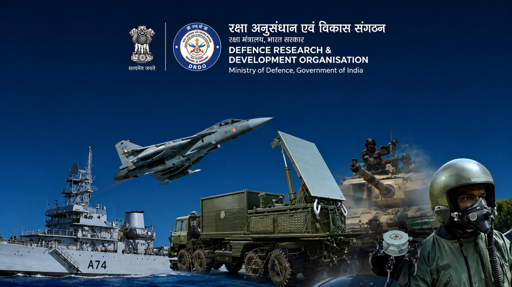
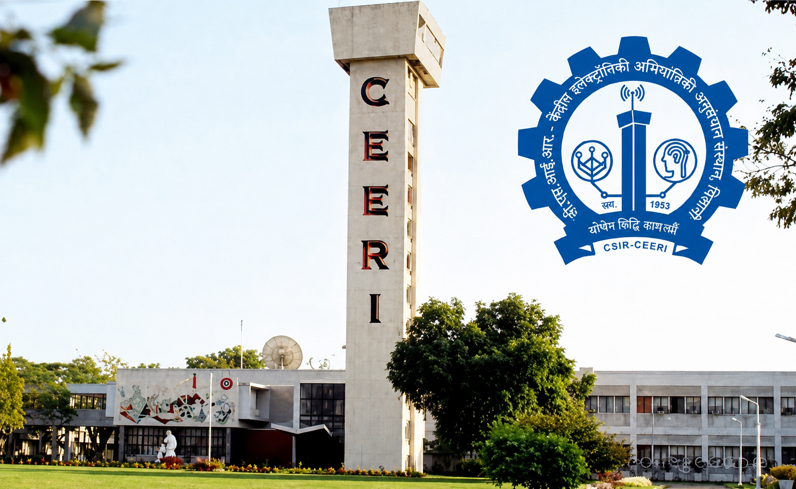

  

  

 

  

 

<!-- ========================================================= -->
<!-- EXPERIENCE -->
<!-- ========================================================= -->

  

 

<!-- ========================================================= -->
<!-- DRDO -->
<!-- ========================================================= -->

  

   

  <h2>DEFENCE RESEARCH &amp; DEVELOPMENT ORGANISATION</h2>

  

    <strong>PROJECT TRAINEE</strong>
  

  

    <samp>JAN 2026 — JUL 2026</samp>
  

   

  

    <i>
      Research-oriented experience within a multidisciplinary defence R&amp;D environment, 
      involving technical exploration, experimental problem solving, 
      and research-driven engineering.
    </i>
  

   

  

    <kbd>DEFENCE R&amp;D</kbd>
    &nbsp;&nbsp;
    <kbd>APPLIED RESEARCH</kbd>
    &nbsp;&nbsp;
    <kbd>TECHNICAL RESEARCH</kbd>
  

  

<!-- ========================================================= -->
<!-- CSIR-CEERI -->
<!-- ========================================================= -->

  

    

  <h2>CSIR–CENTRAL ELECTRONICS ENGINEERING RESEARCH INSTITUTE</h2>

  

    <strong>AI/ML INTERN</strong>
  

  

    <samp>JUN 2025 — JUL 2025</samp>
  

   

  

    <i>
      Developed and benchmarked a real-time infrared hand-gesture detection
      system using YOLOv12 and PyTorch, achieving 91.3% mAP@0.5 at 38 FPS. 
      Built and evaluated a 22,000+ image dataset spanning 60 gesture classes,
      exploring accuracy, inference speed, and edge-deployment trade-offs.
    </i>
  

   

  

    <kbd>COMPUTER VISION</kbd>
    &nbsp;&nbsp;
    <kbd>YOLOv12</kbd>
    &nbsp;&nbsp;
    <kbd>PYTORCH</kbd>
    &nbsp;&nbsp;
    <kbd>EDGE AI</kbd>
  

<!-- ========================================================= -->
<!-- PROJECTS -->
<!-- ========================================================= -->

 

<h2 align="center">PROJECTS:--></h2>

 

<!-- ========================================================= -->
<!-- RETAIL-BRAIN-OS -->
<!-- ========================================================= -->

<h2 align="center">RETAIL-BRAIN-OS</h2>

  

  <i>
    An AI-powered retail intelligence platform that transforms existing
    CCTV infrastructure into structured business insights. It combines
    real-time computer vision, anonymous visitor tracking, zone intelligence,
    dwell-time analytics, and retail behavior analysis to understand
    customer movement and store performance.
  </i>

 

  <kbd>PYTORCH</kbd>
  &nbsp;&nbsp;
  <kbd>BYTETRACK</kbd>
  &nbsp;&nbsp;
  <kbd>MULTI-OBJECT TRACKING</kbd>
  &nbsp;&nbsp;
  <kbd>SPATIAL INTELLIGENCE</kbd>
  &nbsp;&nbsp;
  <kbd>TEMPORAL / STATE INTELLIGENCE</kbd>
  &nbsp;&nbsp;
  <kbd>EVENT PROCESSING</kbd>
  &nbsp;&nbsp;
  <kbd>RETAIL ANALYTICS</kbd>

  <a href="https://github.com/jv906699/Retail-Brain-OS">
    <kbd> VIEW PROJECT → </kbd>
  </a>

 
<!-- ========================================================= -->
<!-- MINI-GPT -->
<!-- ========================================================= -->

<h2 align="center">Mini-GPT</h2>

  

  <i>
    A custom AI assistant built around a fine-tuned TinyLlama 1.1B model,
    enhanced with LoRA/PEFT and a Retrieval-Augmented Generation (RAG)
    pipeline using SentenceTransformers and FAISS. It integrates a
    multi-agent architecture with specialized knowledge, calculator,
    and general-purpose agents to route queries and provide grounded
    responses through an interactive Streamlit interface.
  </i>

 

  <kbd>TINYLLAMA</kbd>
  &nbsp;&nbsp;
  <kbd>LORA / PEFT</kbd>
  &nbsp;&nbsp;
  <kbd>RAG</kbd>
  &nbsp;&nbsp;
  <kbd>FAISS</kbd>
  &nbsp;&nbsp;
  <kbd>SENTENCETRANSFORMERS</kbd>
  &nbsp;&nbsp;
  <kbd>MULTI-AGENT</kbd>
  &nbsp;&nbsp;
  <kbd>PYTORCH</kbd>
  &nbsp;&nbsp;
  <kbd>STREAMLIT</kbd>

 

  <a href="https://github.com/jv906699/Mini-GPT">
    <kbd> VIEW PROJECT → </kbd>
  </a>

 

<!-- ========================================================= -->
<!-- MULTIPLE-OBJECT-DETECTION SYSTEM -->
<!-- ========================================================= -->

<h2 align="center">MULTIPLE-OBJECT-DETECTION SYSTEM</h2>

  

  <i>
    Developed a real-time multi-class YOLOv12 detection system using PyTorch,
    covering dataset preparation, training, evaluation, and inference;
    achieving 88%+ mAP@0.5 at 40+ FPS. Optimized models through
    hyperparameter tuning and experiment tracking, with GUI-based inference
    visualization and model-weight management integrated into a structured,
    reproducible workflow.
  </i>

 

  <kbd>YOLOv12</kbd>
  &nbsp;&nbsp;
  <kbd>PYTORCH</kbd>
  &nbsp;&nbsp;
  <kbd>OBJECT DETECTION</kbd>
  &nbsp;&nbsp;
  <kbd>TRANSFER LEARNING</kbd>
  &nbsp;&nbsp;
  <kbd>HYPERPARAMETER TUNING</kbd>
  &nbsp;&nbsp;
  <kbd>MODEL EVALUATION</kbd>
  &nbsp;&nbsp;
  <kbd>REAL-TIME INFERENCE</kbd>

 

  <a href="https://github.com/jv906699/Multiple-Object-Detector">
    <kbd> VIEW PROJECT → </kbd>
  </a>

 

<!-- ========================================================= -->
<!-- TECH STACK -->
<!-- ========================================================= -->

 

<h2 align="center">TECH STACK</h2>

  <i>
    The technologies and frameworks I use to build AI/ML systems,
    intelligent applications, and real-world AI solutions.
  </i>

 

<!-- MAIN TECHNOLOGY ICONS -->

  

 

<!-- AI / MACHINE LEARNING -->

<h4 align="center">AI / MACHINE LEARNING</h4>

  <kbd>PYTORCH</kbd>
  &nbsp;&nbsp;
  <kbd>TENSORFLOW</kbd>
  &nbsp;&nbsp;
  <kbd>SCIKIT-LEARN</kbd>
  &nbsp;&nbsp;
  <kbd>DEEP LEARNING</kbd>
  &nbsp;&nbsp;
  <kbd>MODEL TRAINING</kbd>

 

<!-- GENERATIVE AI & LLMs -->

<h4 align="center">GENERATIVE AI &amp; LLMs</h4>

  <kbd>TRANSFORMERS</kbd>
  &nbsp;&nbsp;
  <kbd>HUGGING FACE</kbd>
  &nbsp;&nbsp;
  <kbd>TINYLLAMA</kbd>
  &nbsp;&nbsp;
  <kbd>LORA / PEFT</kbd>
  &nbsp;&nbsp;
  <kbd>RAG</kbd>
  &nbsp;&nbsp;
  <kbd>FAISS</kbd>
  &nbsp;&nbsp;
  <kbd>SENTENCETRANSFORMERS</kbd>
  &nbsp;&nbsp;
  <kbd>MULTI-AGENT SYSTEMS</kbd>

 

<!-- COMPUTER VISION -->

<h4 align="center">COMPUTER VISION</h4>

  <kbd>YOLO</kbd>
  &nbsp;&nbsp;
  <kbd>YOLOv12</kbd>
  &nbsp;&nbsp;
  <kbd>BYTETRACK</kbd>
  &nbsp;&nbsp;
  <kbd>MULTI-OBJECT TRACKING</kbd>
  &nbsp;&nbsp;
  <kbd>SPATIAL INTELLIGENCE</kbd>
  &nbsp;&nbsp;
  <kbd>TEMPORAL ANALYTICS</kbd>

 

<!-- AI SYSTEMS & DEPLOYMENT -->

<h4 align="center">AI SYSTEMS &amp; DEPLOYMENT</h4>

  <kbd>AI AGENTS</kbd>
  &nbsp;&nbsp;
  <kbd>LLM APPLICATIONS</kbd>
  &nbsp;&nbsp;
  <kbd>RAG PIPELINES</kbd>
  &nbsp;&nbsp;
  <kbd>INFERENCE PIPELINES</kbd>
  &nbsp;&nbsp;
  <kbd>FASTAPI</kbd>
  &nbsp;&nbsp;
  <kbd>STREAMLIT</kbd>
  &nbsp;&nbsp;
  <kbd>DOCKER</kbd>
  &nbsp;&nbsp;
  <kbd>POSTGRESQL</kbd>
  &nbsp;&nbsp;
  <kbd>REDIS</kbd>

 

<!-- ========================================================= -->
<!-- ACTIVITY -->
<!-- ========================================================= -->

<h2 align="center">ACTIVITY</h2>

  

