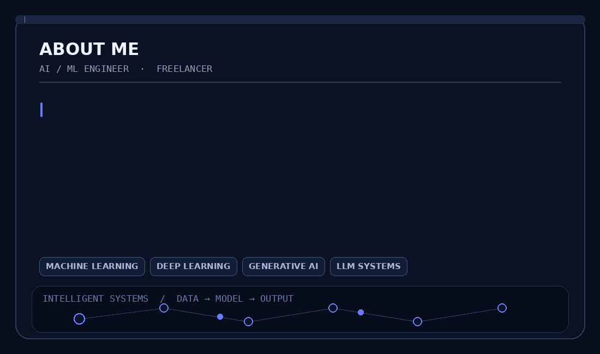
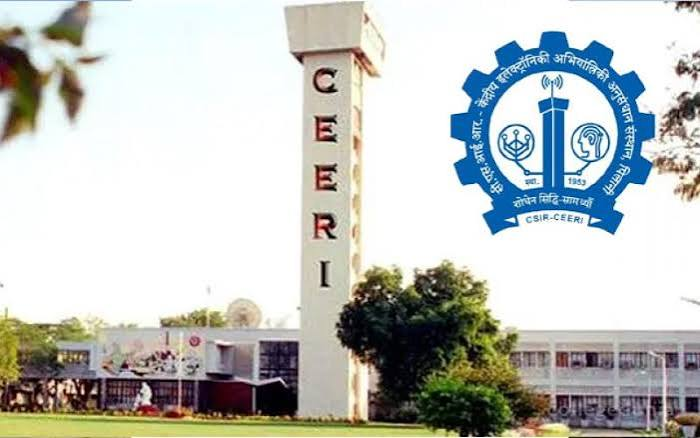

  

  

 

<!-- ========================================================= -->
<!-- ABOUT ME -->
<!-- ========================================================= -->

<h2 align="center">ABOUT ME</h2>

<table>
<tr>

<td width="58%" valign="middle">

I’m an AI/ML Engineer and Freelancer focused on Machine Learning,
Deep Learning, Generative AI, and LLM systems. I build end-to-end AI
solutions, from intelligent models to practical applications, and
enjoy turning ideas into useful, real-world software. My projects
explore areas such as custom language models, intelligent automation,
and applied machine learning.

</td>

<td width="42%" align="center" valign="middle">

</td>

</tr>
</table>

 

<!-- ========================================================= -->
<!-- EXPERIENCE -->
<!-- ========================================================= -->

  

 

<!-- ========================================================= -->
<!-- DRDO -->
<!-- ========================================================= -->

  

    

  <h2>DEFENCE RESEARCH &amp; DEVELOPMENT ORGANISATION</h2>

  

    <strong>PROJECT TRAINEE</strong>
  

  

    <samp>JAN 2026 — JUL 2026</samp>
  

   

  

    <i>
      Research-oriented experience within a multidisciplinary defence R&amp;D environment, 
      involving technical exploration, experimental problem solving, 
      and research-driven engineering.
    </i>
  

   

  

    <kbd>DEFENCE R&amp;D</kbd>
    &nbsp;&nbsp;
    <kbd>APPLIED RESEARCH</kbd>
    &nbsp;&nbsp;
    <kbd>TECHNICAL RESEARCH</kbd>
  

  

  

<!-- ========================================================= -->
<!-- CSIR-CEERI -->
<!-- ========================================================= -->

  

    

  <h2>CSIR–CENTRAL ELECTRONICS ENGINEERING RESEARCH INSTITUTE</h2>

  

    <strong>AI/ML INTERN</strong>
  

  

    <samp>JUN 2025 — JUL 2025</samp>
  

   

  

    <i>
      Developed and benchmarked a real-time infrared hand-gesture detection
      system using YOLOv12 and PyTorch, achieving 91.3% mAP@0.5 at 38 FPS. 
      Built and evaluated a 22,000+ image dataset spanning 60 gesture classes,
      exploring accuracy, inference speed, and edge-deployment trade-offs.
    </i>
  

   

  

    <kbd>COMPUTER VISION</kbd>
    &nbsp;&nbsp;
    <kbd>YOLOv12</kbd>
    &nbsp;&nbsp;
    <kbd>PYTORCH</kbd>
    &nbsp;&nbsp;
    <kbd>EDGE AI</kbd>
  

<!-- ========================================================= -->
<!-- ACTIVITY -->
<!-- ========================================================= -->

<h2 align="center">ACTIVITY</h2>

  

